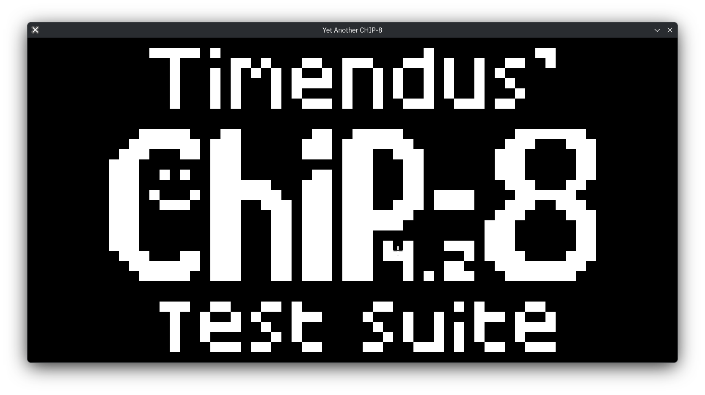
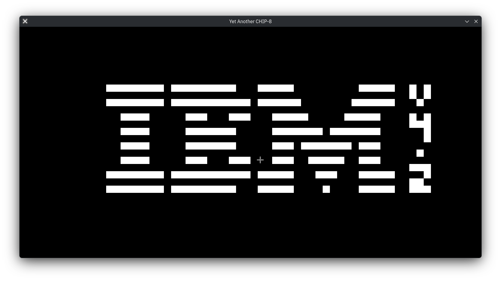
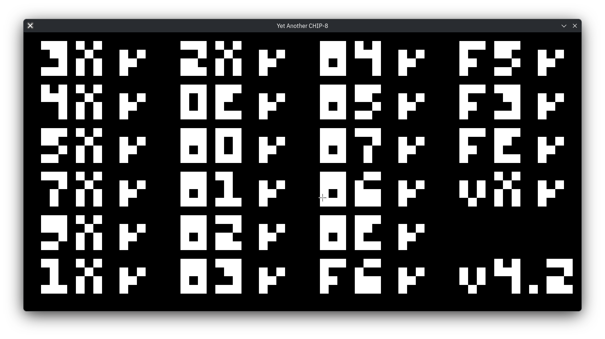
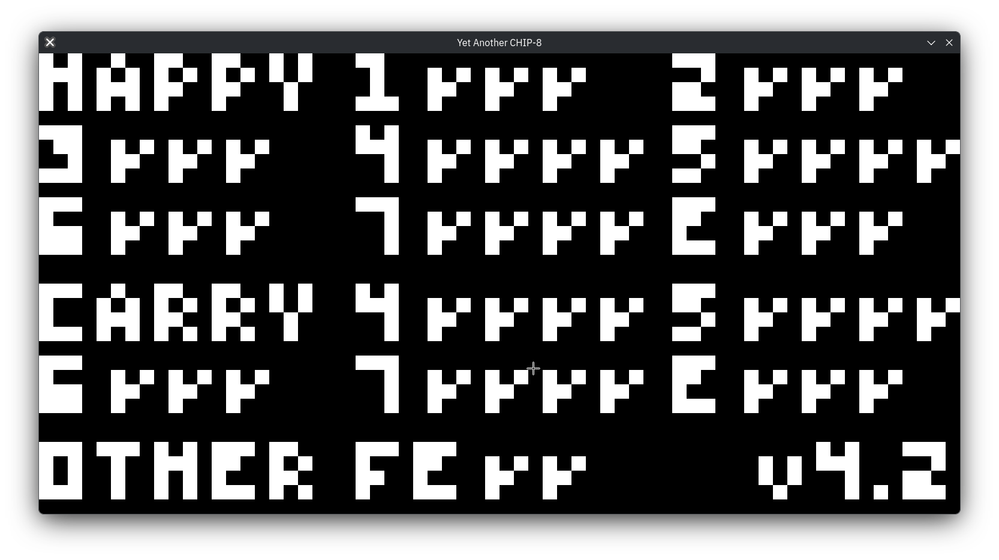
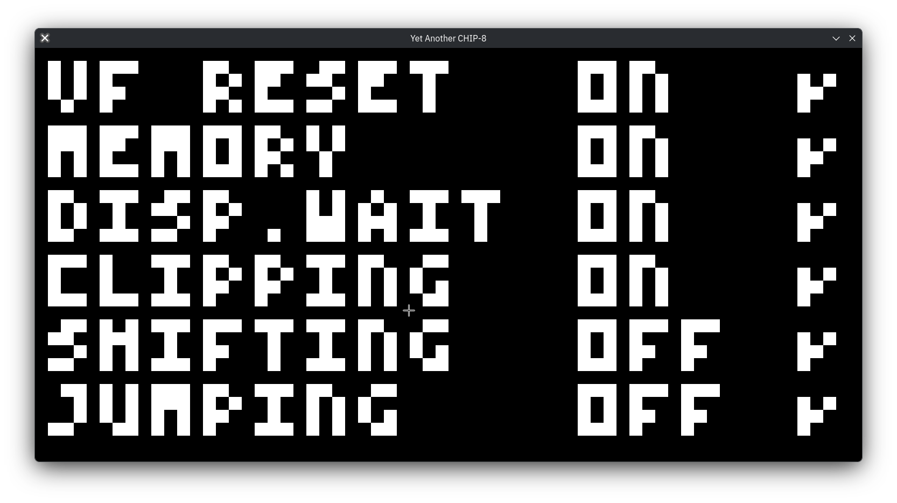
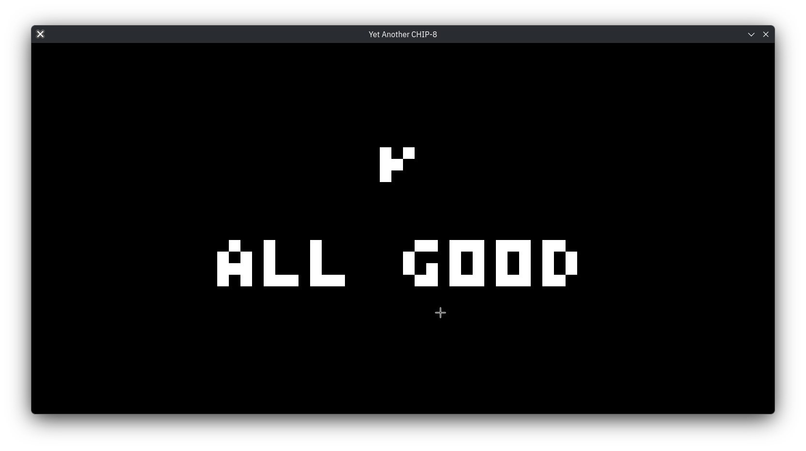
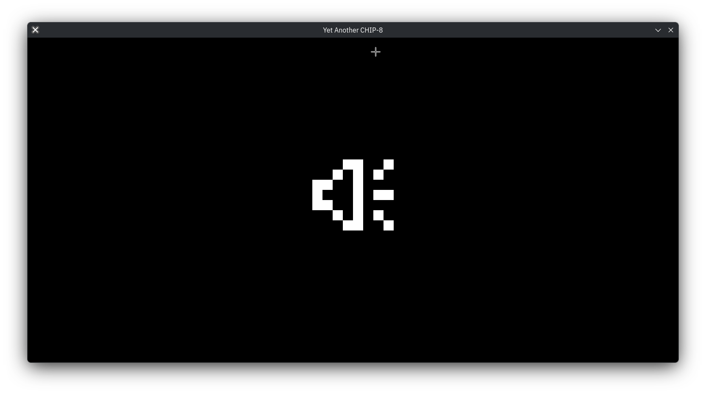

# YA CHIP-8

Yet another CHIP-8 interpreter (or emulator).

## Description

This is an emulator for **[CHIP-8](https://en.wikipedia.org/wiki/CHIP-8)**, a mid 1970's "virtual machine" initially used on the COSMAC VIP and Telmac 1800. It has since been extended into SUPER-CHIP, XO-CHIP, and other variants that introduce features like higher resolutions, more memory, improved sound, color, and more instructions.

YA CHIP-8 is written in C using SDL2 for graphics and input.
The codebase is meant to be clear, readable, and easy to extend.
The goal is to have a spec-correct implementation of the CHIP-8 system, with "correct" behavior validated by passing roms from the **[CHIP-8 Test Suite](https://github.com/Timendus/chip8-test-suite)**.

## Status

The project implements all the standard CHIP-8 instructions including quirks.
It passes all 7 test roms that are included.

<details>
<summary>1 - CHIP-8 Logo</summary>


</details>

<details>
<summary>2 - IBM Logo</summary>


</details>

<details>
<summary>3 - Corax+ Opcode Test</summary>


</details>

<details>
<summary>4 - Flags Test</summary>


</details>

<details>
<summary>5 - Quirks Test</summary>


</details>

<details>
<summary>6 - Keypad Test</summary>


</details>

<details>
<summary>7 - Beep Test</summary>


</details>

## Compiling and Running

Requires GCC and SDL2.

Compile:

```
$ cd yachip8/
$ make
```

Run:

```
$ ./yachip8 ROM_FILE
```

## Controls

The CHIP-8 hexadecimal keypad is mapped to the left side of a QWERTY keyboard:

```
CHIP-8   Keyboard
-------  --------
1 2 3 C  1 2 3 4
4 5 6 D  Q W E R
7 8 9 E  A S D F
A 0 B F  Z X C V
```

## Games to Play (roms)

- **CC0 CHIP-8 Games**: https://johnearnest.github.io/chip8Archive/

## Supported Instructions

### Standard CHIP-8 Instructions

```
[x] 00E0 - CLS               [x] 8xy0 - LD Vx, Vy          [x] Ex9E - SKP Vx
[x] 00EE - RET               [x] 8xy1 - OR Vx, Vy          [x] ExA1 - SKNP Vx
[*] 0nnn - SYS addr          [x] 8xy2 - AND Vx, Vy         [x] Fx07 - LD Vx, DT
[x] 1nnn - JP addr           [x] 8xy3 - XOR Vx, Vy         [x] Fx0A - LD Vx, K
[x] 2nnn - CALL addr         [x] 8xy4 - ADD Vx, Vy         [x] Fx15 - LD DT, Vx
[x] 3xkk - SE Vx, byte       [x] 8xy5 - SUB Vx, Vy         [x] Fx18 - LD ST, Vx
[x] 4xkk - SNE Vx, byte      [x] 8xy6 - SHR Vx             [x] Fx1E - ADD I, Vx
[x] 5xy0 - SE Vx, Vy         [x] 8xy7 - SUBN Vx, Vy        [x] Fx29 - LD F, Vx
[x] 6xkk - LD Vx, byte       [x] 8xyE - SHL Vx             [x] Fx33 - LD B, Vx
[x] 7xkk - ADD Vx, byte      [x] 9xy0 - SNE Vx, Vy         [x] Fx55 - LD [I], Vx
[x] Annn - LD I, addr        [x] Bnnn - JP V0, addr        [x] Fx65 - LD Vx, [I]
[x] Cxkk - RND Vx, byte      [x] Dxyn - DRW Vx, Vy, nibble
```

\*`0nnn` is ignored on modern interpreters (it would call a subroutine on the host machine).

## Resources

- **CHIP-8 Technical Reference**: http://devernay.free.fr/hacks/chip8/C8TECH10.HTM

- **SDL2 Documentation**: https://wiki.libsdl.org/SDL2/

- **More info about CHIP-8 and its extensions**: https://chip-8.github.io/links/
